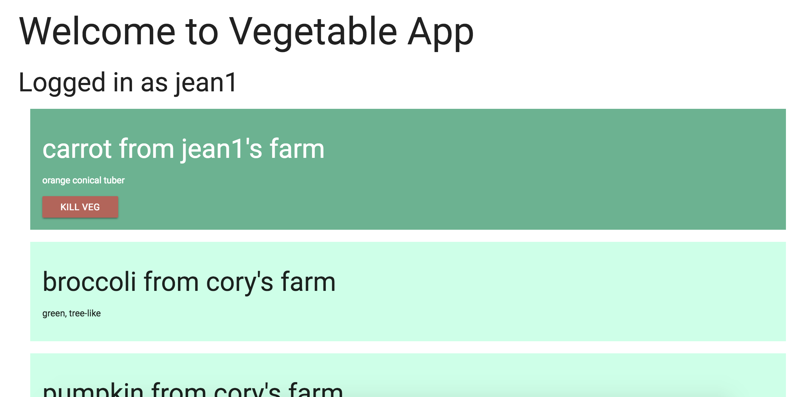

# 

# Passport Auth with React

### Why is this important?

We already know how to do auth with MEN stack apps, but we want to have options of doing auth if we use a framework as well. Because React scripts run on a separate server from the backend, we need to identify what changes should be made to use Passport with React.

### What are the Objectives:

* See how we adjust our usual Passport auth implementation for a React app
* identify the steps needed to use Passport with React

### Where should we be now?

* Should already have implemented simple auth and/or Passport auth with a MEN stack app
* Should have a good understanding of hashing and salting as it relates to passwords and auth
* Should be able to successfully build a basic React app


### Passport Review

We're going to use [passport.js](http://passportjs.org/) for auth. If you want a more detailed tutorial on passport itself, check out the lab [here](https://github.com/SF-WDI-LABS/express-microblog-add-auth).

Passport is a useful middleware library auth in node apps. We will use a local auth strategy, which means we will have the user enter a username and password (not going through Google or FB auth). We're also using `passport-local-mongoose`, which simplifies building username and password auth with passport.

### Investigate the Code


Clone this repo, `npm install`, and navigate around. You'll see that this is a basic React App, and it's a veggie farm meetup. Check out the models. You should see two, Vegetable and User. Vegetable has a reference to User:

```js
var VegetableSchema = new Schema({
  name: String,
  description: String,
  username: String,
  user:
  {
    type: Schema.Types.ObjectId,
    ref: 'User'
  }
});
```

Now let's look at the User. We've required the relevant mongoose middleware and set up a basic User model with a password and string. Passport is going to handle password management/hashing and salting for us.

```js
var mongoose = require('mongoose'),
    Schema = mongoose.Schema,
    passportLocalMongoose = require('passport-local-mongoose');

var UserSchema = new Schema({
  username: String,
  password: String
});

UserSchema.plugin(passportLocalMongoose);
```

Now look at `server.js`.
A lot of the route setup is the same - however, we can't really use `res.redirect()` here because our React routing / frontend is on a different server.

```js
//auth routes
app.get('/api/users', controllers.user.index);
app.delete('/api/users/:user_id',controllers.user.destroy);
app.post('/signup', function signup(req, res) {
  console.log(`${req.body.username} ${req.body.password}`);
  User.register(new User({ username: req.body.username }), req.body.password,
    function (err, newUser) {
      passport.authenticate('local')(req, res, function() {
        res.send(newUser);
      });
    }
  )});
app.post('/login', passport.authenticate('local'), function (req, res) {
  console.log(JSON.stringify(req.user));
  res.send(req.user);
});
app.get('/logout', function (req, res) {
  console.log("BEFORE logout", req);
  req.logout();
  res.send(req);
  console.log("AFTER logout", req);
});
```

Instead, we will need to make ajax (or axios) calls from the frontend to these routes.

Think about how React uses state. We want to conditionally render views depending on if the user is logged in. What are some ways we could do this?

<details>
 <summary>Answer</summary>
 
We'll want to make some state property, `isAuthenticated`, and pass this down as props to child components as needed. We can then conditionally render components based on this.

</details>



The logged in user may delete their veggies but not others.

### making auth API calls from the backend

Now, check out the Signup.js. Notice how we make an ajax call to the backend to create a new user with Passport. We're passing the username and password as data, as we would using Passport with a MEN stack app. Open up three terminal windows, run `mongod`, `node server.js`, and `npm start` to run the app. CRUD some users and vegetables so you can get some data. You may use the seed file for inspiration.

### You do

Investigate the other components and see how `isAuthenticated` is passed down and used to conditionally render views and check for which user is logged in. Discuss in groups how this is working and come up with three questions you have about how it is implemented.
